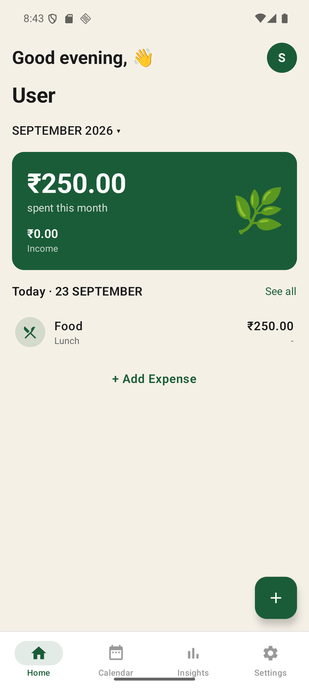

# Pocket

A personal expense manager for Android. Track daily spending by category and
subcategory, browse a calendar of transactions, and review insights with
category breakdowns and monthly trends — all offline, all on-device.


<p align="center">
  
</p>

## Features

- Expense and income tracking with amount, category, subcategory, date, and note
- 11 built-in categories, each with subcategories (plus custom subcategories)
- Custom categories with icon and color
- Calendar month grid with per-day totals and transaction dots
- Insights: spending donut, category breakdown with subcategory drill-down, 6-month trend
- Month-wise filtering on Home, Calendar, and Insights
- Light and dark themes (system / light / dark)
- JSON backup/restore and CSV export via system file picker
- Full data reset from Settings
- First-launch welcome with name entry (auto title-cased)
- Custom launcher icon, themed system splash screen

## Tech Stack

| Layer | Technology |
|---|---|
| UI | Jetpack Compose + Material 3 |
| Navigation | navigation-compose 2.8.9 (instant bottom-tab switches, fades on push screens) |
| Database | Room 2.8.5 (KSP), schema v2 with `subcategories` table |
| Preferences | DataStore Preferences (theme, user name, first-launch flag) |
| Async | Kotlin Coroutines + StateFlow (MVVM, repository pattern) |
| Min / Target SDK | 26 / 36 (compile SDK 36) |
| Language | Kotlin 2.4.20, AGP 9.4.0 |

## Architecture

Single-activity (`MainActivity`) Compose app:

- `ui/<screen>/` — Composables plus one `ViewModel` per screen. ViewModels
  expose `StateFlow<UiState>` built with `combine` over Room `Flow` queries;
  heavy mapping runs on `Dispatchers.Default`, and Calendar keeps its month
  data hot (`SharingStarted.Eagerly`) so tab revisits serve cached state.
- `data/local/` — Room database, DAOs, entities, seed data.
- `data/repository/` — `TransactionRepository`, the single data access point.
- `data/prefs/` — `PocketPrefs` (DataStore).
- `navigation/` — `PocketNavHost` with bottom bar, FAB, and nested
  Insights → Categories → Category-detail flow.

## Project Structure

```text
app/src/main/java/in/marxen/pocket/
├── MainActivity.kt            # entry point, theme wiring
├── PocketApplication.kt       # AppContainer holder
├── core/                      # date + currency utilities (Asia/Kolkata, paise)
├── data/
│   ├── backup/                # JSON backup manager
│   ├── local/                 # Room DB, DAOs, entities, seed data
│   ├── prefs/                 # DataStore preferences
│   └── repository/            # TransactionRepository
├── navigation/                # Routes, PocketNavHost, custom bottom bar
└── ui/
    ├── splash/ welcome/       # launch + onboarding
    ├── home/                  # greeting, balance card, today list
    ├── calendar/              # month grid, day summary
    ├── expense/               # add/edit with subcategories
    ├── insights/              # spending/income/trends, category drill-down
    ├── settings/              # theme, backup/restore, export, reset
    └── theme/                 # colors, typography
docs/
├── PLAN.md / PRD.md           # product plan and requirements
├── chronicles/                # lag debug chronicles
├── lag/                       # prior lag analysis artifacts
└── superpowers/plans/         # dated implementation plans
releases/                      # versioned release APKs
```

## Getting Started

Prerequisites: JDK 17, Android SDK with API 36, a device or emulator.

```bash
./gradlew assembleDebug
./gradlew installDebug
```

## Release

Release builds are signed with `app/pocket-release.jks` (configured in
`app/build.gradle.kts`):

```bash
./gradlew assembleRelease
cp app/build/outputs/apk/release/app-release.apk releases/Pocket-v1.0-release.apk
```

Current release: `releases/Pocket-v1.0-release.apk` (v1.0, versionCode 1).

## Performance Notes

Interaction budget used during development: a tab switch must render a handful
of frames and then stop (verified with `dumpsys gfxinfo` settle sampling —
typically 3–4 frames, frozen). UI-thread stalls (`Slow UI thread`) must read 0
during switches; residual per-frame cost on emulator-class GPUs is environmental.
Cold start is ~2 s on emulator, dominated by the intentional ~1.8 s splash
sequence. See `docs/chronicles/` for full measurement logs.

## Docs Index

- `docs/PLAN.md`, `docs/PRD.md` — what the app is supposed to do
- `docs/chronicles/` — performance debug history with frame measurements
- `docs/superpowers/plans/` — implementation plans per feature/fix

## License

Personal use only.
